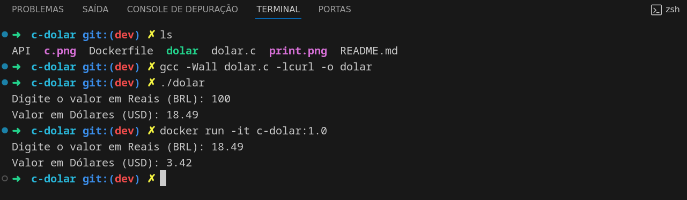

  

#
 Programa simples em C que utiliza a API da Exchangerate para converter um valor em R$BRL para $USD, utilizando a taxa de câmbio.

#### Requisitos

- Compilador C (como GCC)
- Biblioteca libcurl (para fazer requisições HTTP)

#### Compilar e executar

`sudo apt-get install libcurl4-openssl-dev gcc`

`gcc -Wall dolar.c -lcurl -o dolar`

`./dolar`
#### Dockerfile
`docker build -t c-dolar:1.0 .`

`docker run -it c-dolar:1.0`

#

  

   

